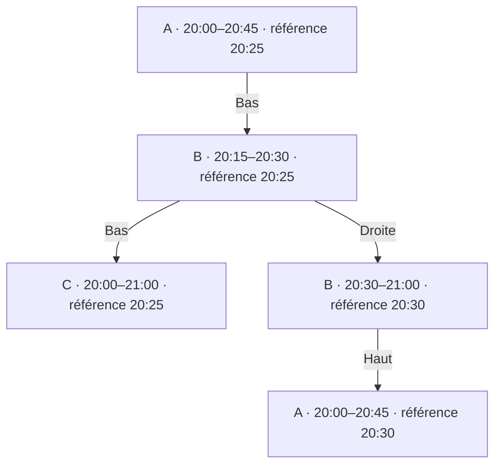

# Guide — interactions et recette du sprint 9

Complément du 20 septembre 2026 au [cadrage Direct/Guide](direct-guide.md).
Les choix ci-dessous suivent la délégation de l’utilisateur de retenir les
recommandations de cadrage. Ils ne constituent ni une recette exécutée ni une
approbation du lot contractuel C1. La composition générale retenue est conservée.

## Navigation et mémoire de consultation

Chaînes et Guide partagent le texte recherché et le filtre pendant la session de
consultation d’une source. Ouvrir une fiche ou revenir du lecteur ne les efface
pas. La mémoire intersessions conserve uniquement la dernière vue par appareil
et par source, comme prévu dans le cadrage ; recherche et filtre repartent vides
et sur Toutes. Un changement de source efface recherche et filtre, ferme la fiche
et invalide les réponses en cours de l’ancienne source. Il retrouve la vue mémorisée
pour la nouvelle source, avec Maintenant si cette vue est Guide.

Les accès explicites depuis l’accueil priment : Toutes les chaînes ouvre Chaînes,
sans recherche et avec Toutes ; Guide TV ouvre Guide sur Maintenant, sans recherche
et avec Toutes. Un simple changement Chaînes/Guide conserve recherche et filtre,
mais l’entrée dans Guide se positionne sur Maintenant. Le retour lecteur restaure
le créneau consulté : ce n’est pas une nouvelle entrée dans Guide.

## Focus TV : conserver une heure de référence

À l’entrée sur Maintenant, sélectionner le programme contenant l’heure courante
sur la première chaîne du résultat filtré. L’intervalle d’un programme comprend
son début et exclut sa fin. Dans une lacune, sélectionner une case neutre de la
ligne, sans action de lecture de programme ; Voir les chaînes reste accessible.

Haut/Bas conserve une heure de référence et sélectionne sur la ligne voisine le
programme qui couvre cette heure, même si sa durée diffère. Une lacune ne fait
pas sauter la chaîne. Gauche/Droite rejoint le programme adjacent de la même
ligne et place l’heure de référence au début de cette nouvelle case. Aux limites
des données disponibles, rester sur la dernière case ; ne pas boucler.

Exemple : référence 20:25, ligne A 20:00–20:45, ligne B 20:15–20:30,
ligne C 20:00–21:00. Descendre puis remonter retrouve A, sans dérive vers 20:00.
Le schéma ci-dessous représente des repères de test, pas des chaînes fournies.

Le déplacement vertical garde la case visible. La navigation temporelle déplace
la fenêtre uniquement si la cible sort du créneau visible. Une mise à jour EPG
ne déplace pas volontairement le focus. Si la case disparaît, retrouver la même
chaîne et la même heure ; si la chaîne disparaît du résultat, prendre la suivante,
ou la précédente en fin de liste, puis le contrôle de filtre si la liste est vide.
Le focus n’atteint jamais un élément masqué ou un squelette de chargement.

## Fiche et temps qui passe

La fiche reste attachée au programme ouvert. Elle ne remplace pas silencieusement
son titre par le suivant. Quand son heure de fin est atteinte, le programme devient
passé et Regarder en direct disparaît. Si ce bouton avait le focus, celui-ci
rejoint Fermer ; la fiche reste ouverte. Un programme futur devenu courant gagne
l’action, sans lui donner automatiquement le focus. Vérifier à nouveau l’état
temporel au moment d’activer l’action. La lecture du direct ne promet pas le début
du programme et ne propose aucun replay.

Fermer ou Retour restitue la case d’origine. Retour ferme d’abord la fiche ; sur
mobile, le Retour suivant remonte de la journée de chaîne à la liste En ce moment.
Après lecture, restaurer recherche, filtre, créneau et ancre de focus, avec le repli
décrit plus haut si le catalogue ou les programmes ont changé.

## Données absentes, chargement et heure locale

Un chargement initial ne doit pas annoncer un guide vide. Une erreur sans données
propose Réessayer et Voir les chaînes. Une erreur avec données garde la grille et
son focus, avec un message d’erreur distinct. Une nouvelle requête ne doit pas
réinjecter une réponse d’une autre source, journée ou recherche.

Une liste EPG vide ne prouve ni une panne ni l’absence définitive d’un guide : le
contrat actuel rend aussi une liste vide pour plusieurs cas non distinguables.
Utiliser « Aucun programme disponible sur ce créneau » sans inventer la cause.
Les noms restent lisibles sans logo ; réserver son emplacement avec un repère
neutre, sans ajouter de marque ou de chaîne réelle aux fixtures.

Afficher les horaires dans le fuseau de l’appareil et raisonner sur des instants
pour les comparaisons. Tester le passage de minuit et les changements d’heure :
deux heures locales identiques peuvent désigner deux instants différents. Une
date/journée sans données ne justifie aucune promesse de disponibilité.

## Cas de recette à exécuter

| ID | Déclencheur | Résultat attendu | Tâches |
|---|---|---|---|
| GD-01 | Recherche et Favoris, puis Chaînes → Guide | Texte et filtre conservés ; position Maintenant | S9-04 |
| GD-02 | Quitter puis rouvrir l’application | Vue mémorisée ; Toutes et recherche vide | S9-04 |
| GD-03 | Changer de source pendant une requête | Ancienne réponse ignorée ; aucun ancien résultat/focus | S9-04 |
| GD-04 | Haut/Bas entre trois durées différentes | Heure de référence conservée, retour réversible | S9-05 |
| GD-05 | Droite puis Bas | Référence au début de la nouvelle case ; bonne case voisine | S9-05 |
| GD-06 | Lacune ou bord de grille | Aucun saut de chaîne ni boucle ; actions de sortie accessibles | S9-05 |
| GD-07 | Fin du programme avec fiche ouverte et bouton focalisé | Action retirée ; focus Fermer ; titre inchangé | S9-06 |
| GD-08 | Programme futur qui commence, puis activation | Action ajoutée sans vol de focus ; état revérifié | S9-06 |
| GD-09 | Retour lecteur après mise à jour du guide | Position conservée ; repli déterministe si case supprimée | S9-05/06 |
| GD-10 | Erreur initiale, puis erreur avec données | États distincts ; Réessayer ; données et focus conservés | S9-06 |
| GD-11 | Guide partiel, logo et description absents | Texte neutre ; aucun logo fictivement attribué ; lecture depuis Chaînes | S9-00/06 |
| GD-12 | Minuit et changement d’heure | Horaires et sélection basés sur les bons instants | S9-00/05 |
| GD-13 | Mobile : fiche → journée → En ce moment | Retour par niveau, position de liste conservée | S9-05/06 |
| GD-14 | FR/EN, clavier web et D-pad réel | Actions nommées, focus visible, pas de piège ni texte tronqué essentiel | S9-07 |

> **Précision du 26 septembre 2026 — GD-10 web.** La seconde moitié du cas (« erreur
> **avec** données » : la grille et la position survivent à une lecture `/epg` en
> échec) est un critère **natif Android/TV**. Le web est rendu côté serveur : il n'a
> pas de grille précédente à conserver. Sur web, seul l'état d'**erreur initiale
> distinct** (message neutre, jamais « guide vide », avec Réessayer et Voir les
> chaînes) est exigé. Décision PO du 26/09 ; voir `docs/backlog/DECISIONS-PRODUIT.md`.

> **Précision du 26 septembre 2026 — GD-03 / changement de source web.** La variante
> du cas « changement de source, fiche ouverte » pilotée par **un autre appareil**
> (`QA-06-04-11`) est un critère **natif Android/TV** pour la 0.2.0. Le web n'a pas de
> source active de compte : le choix de source y est un cookie **par appareil**
> (`lib/sources/active-source.ts` ; l'UI le dit : « Ce choix ne vaut que pour cet
> appareil. ») et la fiche est liée à l'URL `?programme=` **et** à l'id de source du
> chemin, jamais à la source active. L'attendu web accepté — et prouvé — est que la
> fiche d'un appareil reste celle de **sa** source quand un autre appareil change la
> sienne ; le reste de GD-03 (une réponse de l'ancienne source est ignorée) vaut sur
> les trois surfaces. Décision PO du 26/09 ; voir `docs/backlog/DECISIONS-PRODUIT.md`.

Préparer une horloge contrôlable et des identifiants stables dans les fixtures.
La validation navigateur d’un schéma ne remplace ni les tests applicatifs ni la
recette TV réelle. Les dates de test sont relatives ; aucun flux n’est nécessaire
pour tester le guide. Pour une lecture réelle, employer les actifs de test autorisés.

## Dépendance C1 maintenue

L’opération existante `GET /channels/{id}/epg` couvre une chaîne et une fenêtre
bornée. Ce document n’ajoute aucun endpoint. La lecture groupée et la provenance
de la fraîcheur demeurent à soumettre dans S9-01 avant S9-02. Ne pas afficher une
date de récupération client comme une date d’ingestion EPG. Le seuil d’ancienneté,
les volumes et le comportement des limites restent à valider dans C1 ; Q5 est donc
partiellement résolu, pas clos. Ne pas contourner ce besoin par un appel par case.
