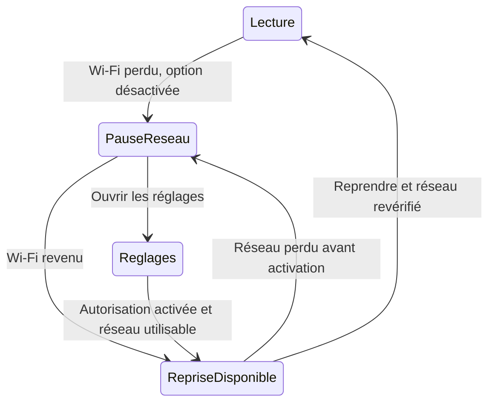
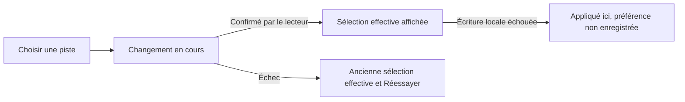

# Lecteur et réglages — décisions Q6/Q7 et recette

23 septembre 2026. Cadrage produit retenu sous la délégation de recommandation de
l’utilisateur ; réalisation et recette non exécutées. Complète [Réglages](settings.md)
et [le sprint 13](../../backlog/sprint-13.md), sans modifier le lot S8-06 d’US-025.
Aucun endpoint, droit d’accès ou mécanisme d’authentification nouveau.

## Q6 — portée et valeurs initiales

| Préférence | Portée retenue | Initialisation et changement de compte |
|---|---|---|
| Interface FR/EN | Installation Android ; navigateur pour le web | Sans choix explicite : langue système compatible sur Android, anglais sinon ; route FR/EN courante sur web, détection et défaut français existants conservés. Choix explicite maintenu après déconnexion |
| Audio préféré | Compte sur cet appareil/navigateur | Langue d’interface lors de la première initialisation ; ensuite indépendante de l’interface |
| Langue des sous-titres | Compte sur cet appareil/navigateur | Même initialisation que l’audio ; activation désactivée au départ |
| Épisode suivant automatique | Compte sur cet appareil/navigateur | Activé initialement, selon le cadrage déjà retenu |
| Lecture sur données mobiles | Installation Android mobile | Activée initialement, selon la décision existante ; maintenue lors d’un changement de compte |
| Qualité manuelle | Lecture courante | Automatique à chaque nouveau contenu ; jamais un choix transmis au compte suivant |

Les préférences de lecture ne se synchronisent pas entre appareils. À la déconnexion,
retirer de la mémoire les choix du compte sortant et arrêter sa lecture selon le
parcours existant ; ne pas appliquer ses langues au compte suivant. Au retour du
même compte sur cette installation, retrouver ses choix locaux s’ils existent.
Une suppression des données locales ou une réinstallation revient aux défauts.
Sur web, un navigateur distinct est un autre contexte local.

Le choix d’interface dans S13 ne déclenche pas `PATCH /me` : la locale déjà exposée
par le compte reste inchangée. Les routes web explicitement préfixées FR/EN restent
respectées ; le choix dans Réglages change la locale de la route en conservant le
parcours utile. Aucun changement de rendu statique du marketing n’est requis.
Une préférence locale ne doit pas être annoncée enregistrée si son écriture échoue.

## Pistes et sous-titres

- Une langue audio absente utilise la piste par défaut lisible, sans écraser la
  langue souhaitée. Si cette piste est inutilisable, employer le repli lisible
  disponible ; si aucune ne l’est, annoncer l’impossibilité au lieu d’inventer une piste.
- Sous-titres désactivés signifie aucune piste textuelle sélectionnée, y compris
  une piste marquée forcée. Des sous-titres incrustés dans l’image ne sont pas
  désactivables : ne pas promettre leur retrait.
- Sous-titres activés : chercher la langue préférée ; privilégier une piste complète,
  puis une piste forcée de cette langue si elle seule existe. Sans langue correspondante,
  ne sélectionner aucune autre langue et conserver la préférence.
- Parmi plusieurs pistes compatibles de même langue, préférer celle marquée par
  défaut, puis l’ordre stable exposé par le lecteur. Un choix manuel prime pour le
  contenu courant ; ne jamais réutiliser son identifiant sur un autre média.
- Une piste sans langue se nomme « Piste 1 », « Piste 2 », selon son ordre, avec son
  nom fourni si utile. Son choix est local au contenu et ne remplace pas une préférence
  de langue. N’afficher « forcés », « audiodescription » ou des caractéristiques que
  si les métadonnées les attestent. Aucun rôle ne se déduit du seul nom de fichier.
- Une piste identifiée mais non prise en charge reste explicitement indisponible.
  Si le lecteur ne permet pas de connaître les pistes, annoncer cette limite plutôt
  que « aucune piste » ; vérifier la faisabilité par surface dans S13-00.
- Pendant un changement, indiquer l’action en cours. Ne confirmer la sélection
  effective qu’après retour du lecteur. En échec, garder ou rétablir la sélection
  effective précédente quand possible et proposer Réessayer ; aucune boucle de réessais.

À l’ouverture du menu, focus sur le choix effectif ; si indisponible, première
commande utilisable, sinon Fermer. Retour ferme le menu et retrouve son déclencheur.
Les états asynchrones ne doivent pas voler le focus ni laisser celui-ci sur un
élément disparu. Une erreur de persistance distingue « appliqué pour cette lecture »
de « enregistré pour les prochaines lectures ».

## Q7 — réseau mobile et reprise

L’option concerne la vidéo, pas tout le trafic du catalogue. Son explication doit
dire « Désactivé : lecture uniquement en Wi-Fi ». Le Wi-Fi n’est pas une promesse
de gratuité : une connexion Wi-Fi facturée reste autorisée par cette règle.

| Réseau effectif, option désactivée | Résultat |
|---|---|
| Wi-Fi utilisable, même facturé | Lecture autorisée |
| Données mobiles ou Ethernet | Bloqué : Wi-Fi requis |
| VPN avec réseau sous-jacent Wi-Fi identifié | Autorisé si connexion utilisable |
| VPN sur réseau mobile, réseau sous-jacent inconnu ou réseau indéterminé | Bloqué : impossible de confirmer le Wi-Fi |
| Wi-Fi sans accès utilisable, portail captif ou perte de connexion | Lecture interrompue ; message de connexion, sans bascule mobile implicite |

Vérifier le réseau utilisé, pas seulement l’icône Wi-Fi ou l’existence d’une
interface Wi-Fi. Les capacités de détection restent à vérifier sur Android dans
S13-05 ; en cas d’incertitude, appliquer le blocage, sans annoncer une preuve technique
que la plateforme ne fournit pas.

Perte du réseau autorisé pendant une vidéo : pause, position conservée et arrêt
des nouvelles requêtes média, y compris préchargement de l’épisode suivant. Vérifier
l’annulation des transferts en cours à la recette ; ne pas garantir zéro octet déjà
en transit. La simple mise en pause visuelle ne suffit pas.

Au retour du Wi-Fi, rester en pause et proposer Reprendre. Aucun redémarrage spontané,
ni rattrapage automatique d’un décompte d’autoplay annulé. Reprendre relit le réseau
actuel avant toute requête média. Pour le direct, rejoindre le direct courant ;
pour film/épisode, reprendre la position disponible, sans promettre du timeshift.

Le blocage présente Réessayer, Ouvrir les réglages de lecture et Retour. Aller dans
les réglages ne change rien implicitement. Si l’utilisateur active les données mobiles,
revenir au lecteur en pause puis demander Reprendre. Désactiver l’option pendant une
lecture non Wi-Fi produit immédiatement la même interruption. Tous les départs
(fiche, Continuer, chaîne, reprise, autoplay) passent par la même règle.

## États visuels complémentaires

Ces schémas décrivent les transitions, sans remplacer les écrans S13-E01 à E10.

| État | Texte FR / EN à intégrer à l’i18n | Action et focus |
|---|---|---|
| Réseau bloqué | Wi-Fi requis / Wi-Fi required | Réessayer ; Retour disponible |
| Réseau rétabli après pause | Wi-Fi disponible. Reprendre la lecture ? / Wi-Fi available. Resume playback? | Reprendre ; aucune activation automatique |
| Piste inaccessible | Cette piste n’est pas prise en charge sur cet appareil / This track is not supported on this device | Choix indisponible, Fermer accessible |
| Langue absente | Votre langue de sous-titres n’est pas disponible / Your subtitle language is unavailable | Garder la préférence ; choix manuel possible |
| Écriture locale échouée | Appliqué pour cette lecture. Préférence non enregistrée / Applied for this playback. Preference not saved | Réessayer l’enregistrement ; conserver le focus |

## Cas de recette à exécuter

| ID | Scénario | Attendu | Lot |
|---|---|---|---|
| PS-01 | Première installation puis changement FR/EN | Défauts cohérents ; langues de lecture déjà initialisées inchangées | S13-02/04 |
| PS-02 | Compte A → B → A sur le même appareil | Langues isolées, choix A retrouvés ; réseau inchangé | S13-02/05 |
| PS-03 | Même compte sur deux appareils | Préférences de lecture indépendantes | S13-02 |
| PS-04 | Langue audio/sous-titres absente puis présente au contenu suivant | Replis prévus sans écrasement de préférence | S13-01/02 |
| PS-05 | Sous-titres désactivés, forcés et incrustés | Aucune piste texte activée ; aucune promesse sur les incrustés | S13-00/01 |
| PS-06 | Pistes sans langue ou même langue multiple | Libellés distincts et ordre stable ; identifiants non réutilisés | S13-01/02 |
| PS-07 | Changement de piste échoué ou stockage local refusé | Erreur honnête et sélection effective distinguée de préférence | S13-01/02 |
| PS-08 | Wi-Fi perdu puis retrouvé pendant VOD et direct | Pause maintenue, reprise explicite ; direct courant | S13-05 |
| PS-09 | Wi-Fi facturé, Ethernet, VPN et réseau inconnu | Matrice Q7 respectée sans déduction depuis une icône | S13-05 |
| PS-10 | Wi-Fi captif et bascule mobile | Aucun démarrage ou transfert média mobile implicite | S13-05 |
| PS-11 | Désactiver l’option pendant lecture mobile | Interruption et suspension des requêtes média | S13-05 |
| PS-12 | Autoplay ou reprise pendant blocage et retour réseau | Aucun lancement différé automatique ; nouvelle vérification | S13-03/05 |
| PS-13 | FR/EN, clavier, tactile et télécommande | Focus restauré, libellés lisibles et actions accessibles | S13-06 |

La recette réseau nécessite un appareil Android et une preuve des requêtes média,
pas seulement un changement d’état dans une maquette. Les fixtures multi-pistes
doivent être autorisées selon AGENTS.md. Les capacités réelles restent une condition
de réalisation ; Q6/Q7 sont cadrés côté produit, sans déclarer les tâches terminées.
